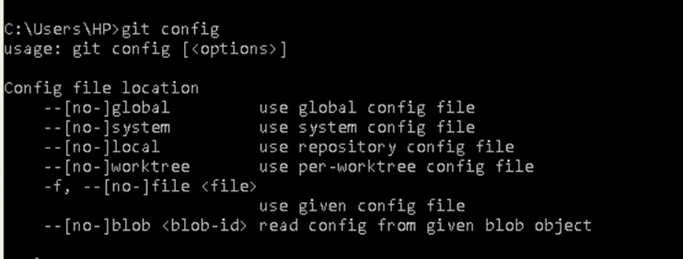
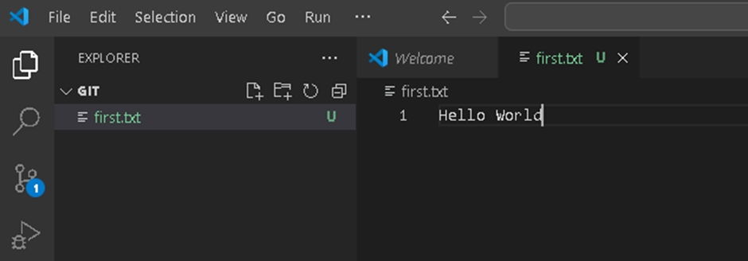
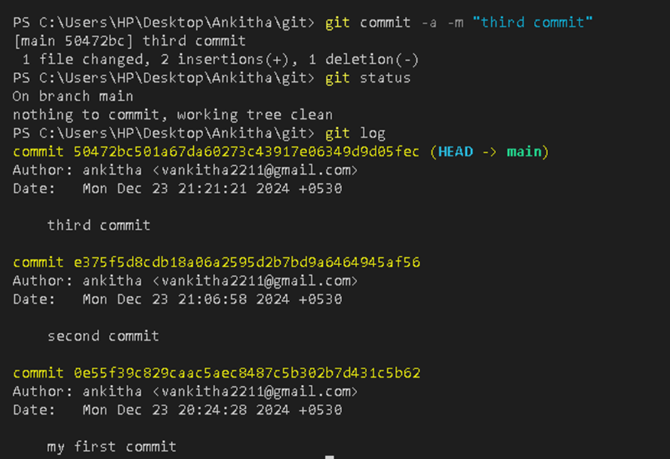
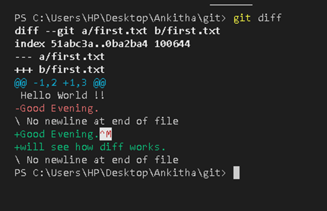
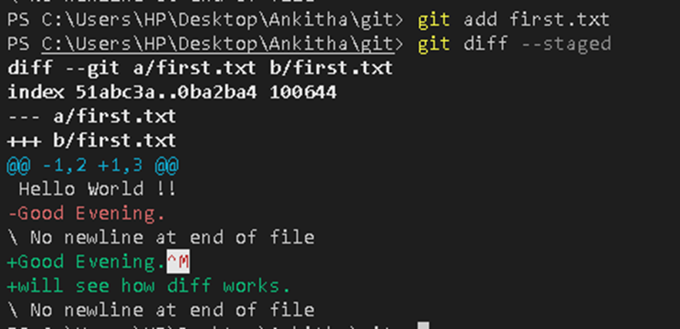
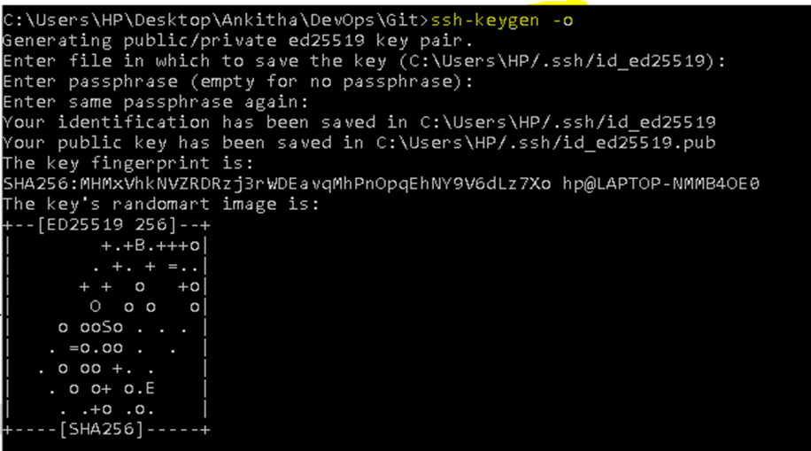
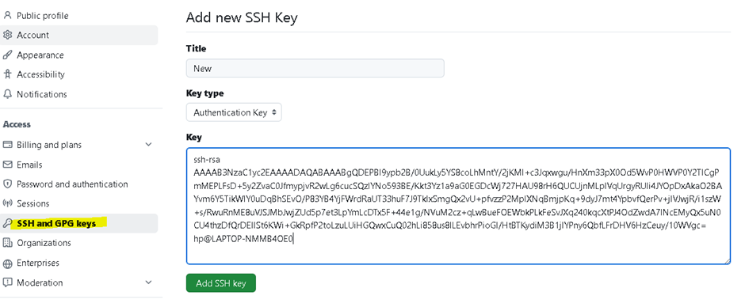
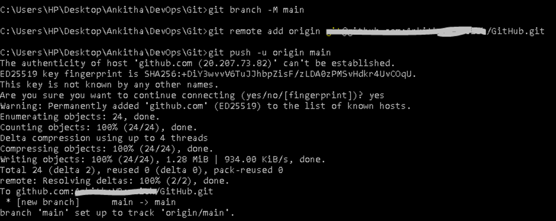

# Git (Global Information Tracker)
Git is a distributed version control system.
# What is Version Control?
When working on a project, we often make multiple updates and save these updates in different folders to access previous versions when needed. Version control simplifies this process by tracking changes in a structured way.
# Why Use Git?
***Collaboration***                                          
If multiple people are working on the same project and need to collaborate on code, Git allows seamless integration and management of their work.

# Types of Version Control Systems     

# 1.	Local Version Control           
In this system, developers save projects on their local machines.     
• Disadvantage: If the machine crashes, all files are lost.  

# 2.	Centralized Version Control System (CVCS)          
A central repository is used for collaboration. Developers copy the repository to their local machines, make changes, and commit these changes back to the central server.                              
Advantages:                                                                
  •	Everyone has access to the central repository.     
  •	Changes are visible to all collaborators after each commit.                 
Disadvantages:                                                                        
  •	If the central server goes down, all progress and access to the repository are lost.                   

# 3.	Distributed Version Control System (DVCS)          
Each user has a full copy of the repository, including the complete version history.                     
Advantages:                                  
  •	Local backups of the repository exist for every user.                                                 
  •	Collaboration is seamless, even if the central server goes down.                                       

# Downloading Git
Git download link:          
```
https://git-scm.com/downloads
```
After installation, verify Git by running            
```
git --version            
```


# Configuring Git    
Git needs to be configured so we know who is making changes.          

 
# Check Existing Configuration
```
git config --global –list
```
 

Set User Name and Email      
```
git config --global user.name "your-name"  
```
```
git config --global user.email "your-email"
```

 
We configure Git to provide information about who is making changes to the repository.     
Configuration ensures that all changes, commits, and contributions are properly attributed to the correct user, making it easier to track and manage work in collaborative environments.

***Identify Contributors***                         
• Each commit is tagged with the user.name and user.email of the person who made the change, helping teams track contributions.  

***Improve Collaboration***                             
• In a team setting, knowing who made specific changes helps in communication and accountability. 

***	Enable Git Functionality***     
• Git requires a user identity (user.name and user.email) to associate commits with a specific person. Without this configuration, Git may display warnings or fail to commit changes.          

# Creating a Local Repository 
***Initialize a Repository:***  
```
git init
```
By default, Git creates a branch named master.        


***Initialize with a Custom Branch Name:***     
```
git init -b main
```
•	If your Git version is older than 2.28.0, the -b option won't work.     
•	To update Git, download the latest version from the Git website.           
•	Alternatively, use the following commands to rename the default branch:         
```
git init
git branch -m main or git branch -M main
```


# Understanding the .git Folder      
The .git folder contains all the metadata for the repository, including:        
•	The staging area            
•	Commit history                     
•	Other tracking information                    
Basic Git Commands        
1.	Check the Project Status                
```
git status
```


2.	Create a File              
•	Create a new file in the working directory.                         


3.	Track Changes                    
•	Add the file to the staging area:                       
```
git add filename 
```
if you want to add multiple files                     
```
git add .
```


4.	Save or Commit Changes                
•	Commit the changes with a message:                       
``` 
git commit -m "your-message"
```
•	After committing, Git starts tracking the file.                  
 

# Git and Checksum 
•	Git creates a checksum for every commit to uniquely identify it.                 
•	The checksum is a 40-character hexadecimal string.            
•	In some cases, Git displays only the first 7 characters of the checksum for brevity            
Example of a checksum:              


# Viewing Commit History             
•	Use git log to see the log of all commits.               
•	The log includes details such as:       
o	Full 40-character checksum               
o	Commit author                
o	Date of the commit                 
o	Commit message                   


# Skipping the Staging Step                  
•	If you want to skip adding changes to the staging area before committing, use the -a flag.  
o	Command:                
```
git commit -a -m "message"
```
o	This automatically stages all modified files (but not new, untracked files) and commits them in one step.                 


# Git Commands for Managing Changes and Files           
1. Git diff Command                        
The git diff command is used to find differences between changes you have made and the previous state of the repository. It helps in identifying what has changed in the files.            
Purpose             
•	To see the changes made in your working directory compared to the last commit.        
•	To review modifications before staging or committing them.               
Common Scenarios            
1.	View Changes in the Working Directory             
Show differences between files in the working directory and the latest commit:             
```
git diff
```
2.	View Staged Changes                 
Show differences between staged changes (added with git add) and the latest commit:               
```
git diff --cached         
```
3.	Compare Two Commits                  
Show differences between two specific commits:                
```
git diff commit1 commit2                        
```
4.	Compare a Branch with the Current Branch                  
Show differences between a branch and your current branch:                     
```
git diff branch_name
```
Output             
•	The output shows line-by-line differences:             
o	Lines added are prefixed with +.               
o	Lines removed are prefixed with -.                  

 
•	To see differences between the staging area and the last commit:                       
```
git diff --staged
```

 
1. Remove a File from Git Repository            
To remove a file from the Git repository while keeping it in the local file system, use:           
```
git rm --cached filename
```
2. Clone a Repository             
If you have a repository and want to copy it to your local machine, use the git clone command:   
```
git clone repository-url
```
•	The repository-url can be an HTTPS URL, SSH URL, or a local file path.                            
•	After cloning, you will have a complete copy of the repository, including all files and version history.                          

# How to Connect a Local Repository to a Remote Repository

1. Generate an SSH Key (One-Time Setup)               
To enable secure communication between your local machine and a remote repository (e.g., GitHub):        
1.	Run the following command to generate an SSH key:          
```
ssh-keygen -o
```
•	The key will be saved in the .ssh directory on your machine.    

2.	Locate the generated key in the .ssh folder (typically ~/.ssh/id_rsa.pub).          
 
 

2. Add the SSH Key to GitHub
1.	Copy the contents of the public key file (id_rsa.pub). You can use the following command:         
```
cat ~/.ssh/id_rsa.pub
```
3.	Log in to your GitHub account.                   
4.	Navigate to Settings → SSH and GPG keys.                 
5.	Click on New SSH key.                         
6.	Provide a title for the key (e.g., "My Laptop SSH Key").            
7.	Paste the copied key into the Key field.                    
8.	Click Add SSH key.                  
Now, your local machine (client) and GitHub (server) are connected. This allows GitHub to verify your identity when you push changes.         
 

3. Connect the Local Repository to a Remote Repository          
Run the following command to link your local repository to the remote repository:             
```
git remote add origin <repository-url>
```
•	Replace <repository-url> with the SSH URL of your GitHub repository.               
•	The origin keyword is an alias for the remote repository.                

4. Push Code from Local to Remote                   
Use the following command to push your code to the remote repository for the first time:           
```
git push -u origin main
```
•	-u sets the upstream branch so that future pushes can be done using git push.              
•	main is the branch name. Replace it with the appropriate branch name if different.           
 
 

# Tagging
1.	View Tags: Displays all tags associated with the project.          
```
git tag
``` 

1.	Create a Tag:      
•	Lightweight Tagging: A simple tag pointing to a commit without additional metadata.
git tag tagname         
•	Annotated Tagging: Includes additional metadata such as the author's name, date, and a message. This is typically used for releases. 
```           
git tag -a tagname -m "annotation message"  
```     
2.	View Tag Details: Displays detailed information about the specified tag.                     
``` 
git show tagname
``` 

3.	Push a Tag to Remote:
``` 
git push origin tagname
``` 

4.	View Commit Logs with Tags:Shows commit checksums along with their messages.
``` 
git log --pretty=oneline
``` 

# Branching
Branches allow you to work on a specific feature or fix bugs without affecting the main branch.

1.	Why Use Branching?                       
•	Prevent errors in the main branch during development.                  
•	Facilitate isolated work on new features.               

2.	Create a Branch:               
•	Using checkout:    
```           
git checkout -b branchname  
```            
•	Using switch (recommended for newer Git versions):    
```      
git switch -c branchname
```
3.	View Branches:
•	Show local branches:              
```
git branch
```
•	Show all branches (local and remote):             
```
git branch --all
```
•	The * symbol indicates the branch you are currently on.              

4.	Switch Between Branches:
•	Switch to a specific branch:
```
git switch branchname
```
•	Switch to the previous branch:
```
git switch -
```
•	Using checkout (older syntax):
```
git checkout branchname
```

5.	Delete a Branch:
```
git branch -d branchname
```

6.	Push a Branch to Remote:
```
git push origin branchname
```

# Commits and Snapshots
1.	How Git Tracks Changes:                 
•	Each commit creates a snapshot of your files and assigns a unique identifier called a checksum.  

2.	Pointers:             
•	Git uses pointers to track the latest commit in a branch.          
•	When creating a new branch, the pointer initially points to the same commit as the main branch.   

# Merging Branches
1.	Why Merge?              
•	Combine changes from one branch into another, typically merging a feature branch into the main branch. 
2.	Steps to Merge:          
•	Ensure you are on the target branch (e.g., main):           
```
git switch main
```
•	Pull the latest changes to ensure the branch is up-to-date:           
```
git pull origin main
```
•	Merge the desired branch into the main branch:
```
git merge branchname
```
